# AgentScope 多智能体运行监测与效能分析平台

AgentScope 是一个针对多智能体（Multi-Agent）系统设计的大数据观测、实时监控与效能分析平台。本项目提供了一个完整的“实时监控 + 离线分析”双链路 Lambda 大数据处理架构，旨在解决多 Agent 系统在黑盒运行过程中面临的**状态不可见、调用难追踪、效能难评估、异常难定位**等问题。

通过 AgentScope，您可以对 Agent 的运行数据进行实时采集、流式计算、离线导入、数据清洗、多维指标统计、拓扑关系提取和可视化展示，并利用大语言模型（LLM，如 DeepSeek-V4-Flash）自动生成系统效能诊断报告。

---

## 🎯 核心特性

*   **双链路数据流处理**:
    *   **实时流式计算链路**: 基于 `Kafka ➔ Spark Streaming ➔ Redis`，实现毫秒级的实时吞吐、延时及调用频次指标监测与异常容错告警。
    *   **离线数仓深度链路**: 基于 `DataX ➔ HDFS ➔ Spark Batch (Scala) ➔ MySQL`，实现海量历史大数据的深度去重清洗与 T+1 复杂指标模型计算。
*   **离线数仓规范分层（ODS ➔ DWD ➔ DWS）**:
    *   **ODS（原始落地层）**：DataX 自动采集业务库源数据落地 HDFS，保持原始 JSON / CSV 格式。
    *   **DWD（明细数据层）**：Spark 清洗作业剔除异常脏数据，并按 `event_id` 严格去重，输出标准化 Parquet 列存文件。
    *   **DWS（汇总数据层）**：5 个 Spark 离线作业按天、按 Agent、按协作网络等多维主题进行轻度汇总计算，保证成功率等核心指标的数学自洽性，供下游直接低时延消费。
*   **多维效能指标与关系图谱**: 提取耗时分布、Token 消耗成本、错误失败分布等关键效能指标，并通过分析链路调用，自动还原 Agent 之间的协作拓扑网络与依赖关系。
*   **AI 智能效能诊断报告**: 深度对接大语言模型（LLM），读取 DWS 层汇总指标自动生成富文本排版的系统运行日报与效能分析报告，支持行内代码格式渲染与水平分隔符优化。
*   **一键式自动化调度与数据注入**: 
    *   提供一键执行总控脚本，并支持 Crontab 定时调度，展示正在执行节点的霓虹高亮效果。
    *   提供前端一键远程命令触发器，支持随时远程向 Master 注入任意选定日期的模拟用户行为数据。

---

## 🏗️ 系统架构

本项目采用经典的 Lambda 大数据架构，其核心技术流与数据分层拓扑如下：

```mermaid
graph LR
    %% 定义高颜值蓝色/青色系主题样式
    classDef source fill:#0f172a,stroke:#3b82f6,stroke-width:2px,color:#eff6ff;
    classDef stream fill:#0f172a,stroke:#06b6d4,stroke-width:2px,color:#eff6ff;
    classDef batch fill:#0f172a,stroke:#38bdf8,stroke-width:2px,color:#eff6ff;
    classDef database fill:#1e293b,stroke:#2563eb,stroke-width:2px,color:#eff6ff;
    classDef service fill:#1e1b4b,stroke:#6366f1,stroke-width:2px,color:#eff6ff;
    classDef ui fill:#022c22,stroke:#06b6d4,stroke-width:2px,color:#eff6ff;

    subgraph Src[数据源]
        Sim["Agent 运行模拟器 (Python)"]:::source
    end
    
    subgraph StreamingPipeline[实时流监控]
        Kafka["Kafka 消息队列"]:::stream
        SparkStreaming["Spark Streaming 引擎"]:::stream
        Redis[("Redis 缓存状态")]:::database
    end
    
    subgraph BatchPipeline[离线数仓计算]
        MySQL_Src[("MySQL Source 业务源库")]:::database
        DataX["DataX 同步管道"]:::batch
        HDFS_Raw["HDFS ODS 原始层"]:::batch
        SparkClean["Spark DWD 清洗层"]:::batch
        SparkBatch["Spark DWS 汇总层"]:::batch
        MySQL_Ana[("MySQL Analytics 分析库")]:::database
    end
    
    subgraph Serving[微服务与展示]
        FastAPI["FastAPI 业务网关"]:::service
        LLM["LLM AI 分析接口"]:::service
        VueUI["Vue 3 ECharts 大屏/管理端"]:::ui
    end

    %% 数据链路关联关系
    Sim -. 实时写入 Kafka Producer .-> Kafka
    Sim -->|离线落地 JDBC| MySQL_Src
    
    %% 实时流转
    Kafka -->|微批次 Pull| SparkStreaming
    SparkStreaming -->|实时汇总 & 告警| Redis
    
    %% 离线数仓流转
    MySQL_Src -->|定时 DataX 调度| DataX
    DataX -->|HDFS Write| HDFS_Raw
    HDFS_Raw -->|CleanJob Scala| SparkClean
    SparkClean -->|Parquet| SparkBatch
    SparkBatch -->|JDBC Write| MySQL_Ana
    
    %% 服务与展示关联
    Redis -->|数据读取| FastAPI
    MySQL_Ana -->|指标查询 & 作业控制| FastAPI
    FastAPI -->|指标快照推送| LLM
    LLM -->|分析报告生成| FastAPI
    FastAPI -->|API & Server-Sent Events| VueUI
```



---

## 📁 目录结构

```text
agentscope/
├── backend/              # FastAPI 后端服务 (提供大盘 REST API、任务控制与 AI 报告生成)
├── frontend/             # Vue 3 + ECharts 大屏可视化前端与数仓治理管理端
├── simulator/            # Agent 事件模拟器 (支持实时 Kafka 发送和离线 MySQL 历史数据注入)
├── spark-streaming/      # Spark Streaming 实时计算作业 (Scala 2.11 + Spark 2.4)
├── spark-batch/          # Spark Batch 离线清洗、数仓聚合分析作业 (Scala 2.11 + Spark 2.4)
├── sql/                  # 数据库架构初始化脚本 (业务库 source 与数仓库 analytics)
├── scripts/              # 运维控制与自动化总控脚本 (DataX 导入, Spark 提交, 健康检查等)
└── docs/                 # 项目技术文档、部署架构方案与性能测试报告
```

---

## 🚀 快速开始

本项目依赖真实的 Hadoop/Spark 分布式集群环境运行。

### 1. 环境准备与初始化

1. 确保 Hadoop (HDFS, YARN), Spark (Standalone/YARN), Kafka, Redis, MySQL 正常运行。
2. 初始化数据库结构：
   ```bash
   mysql -u root -p < sql/source_schema.sql
   mysql -u root -p < sql/analytics_schema.sql
   ```
3. 创建 Kafka 实时主题：
   ```bash
   bash scripts/create_kafka_topics.sh
   ```

### 2. 启动服务

**启动后端服务 (FastAPI):**
```bash
cd backend
python -m venv .venv
source .venv/bin/activate
pip install -r requirements.txt
uvicorn app.main:app --host 0.0.0.0 --port 8000 &
```

**启动实时监控链路 (Spark Streaming):**
```bash
bash scripts/start_streaming_job.sh
```

**构建并运行前端大屏 (Vue 3 + Vite):**
```bash
cd frontend
npm install
npm run build     # 静态打包输出
# 或使用本地调试开发服务：
npm run dev -- --host 0.0.0.0 --port 5173
```

---

## 📊 数据管道运维与测试

### 1. 产生模拟数据
* **实时模式**（向 Kafka 持续注入流数据）：
  ```bash
  python simulator/main.py --mode realtime --kafka-bootstrap middleware:9092 --rate 15
  ```
* **离线数据手工生成**：
  您可以通过数据管理前端（`/admin`）的 **「数据任务管理」**，在日期选择器选定日期后，点击 **「生成所选日期模拟数据」** 按钮，系统将自动远程调用集群模拟脚本，将测试数据写入 MySQL Source 库。

### 2. 离线数仓 Pipeline 执行
执行离线总控脚本，流水线将自动完成 ODS ➔ DWD ➔ DWS 数据流转（包含 DataX 同步、Spark 清洗及指标统计）：
```bash
bash scripts/run_daily_offline_pipeline.sh 2026-06-30
```
在执行过程中，数据管理端的**运行卡片将呈现亮眼的青色霓虹发光动效**，指示当前作业在数仓中的流转状态。

---

## 🛠️ 系统自检与测试工具

*   `health_check.sh`: **集群一键体检工具**。快速探活 HDFS, YARN, Spark, Kafka, ZK, Redis, MySQL 等所有服务组件。
*   `test_fault_tolerance.sh`: **容错与限流机制测试**。向流处理中写入畸形字段和脏数据，验证 Spark 的鲁棒度与实时异常捕获告警。
*   `benchmark.sh`: **压力测试工具**。测试实时流式计算在不同高并发写入下的处理吞吐上限。

---
*Powered by Apache Hadoop, Apache Spark, Apache Kafka, FastAPI, Vue 3, and DeepSeek.*
