# AgentScope 多智能体运行监测与效能分析平台

AgentScope 是一个针对多智能体（Multi-Agent）系统设计的大数据观测、实时监控与效能分析平台。本项目提供了一个完整的“实时监控 + 离线分析”双链路 Lambda 大数据处理架构，旨在解决多 Agent 系统在黑盒运行过程中面临的**状态不可见、调用难追踪、效能难评估、异常难定位**等问题。

通过 AgentScope，您可以对 Agent 的运行数据进行实时采集、流式计算、离线导入、数据清洗、多维指标统计、拓扑关系提取和可视化展示，并利用大语言模型（LLM，如 DeepSeek-V4-Flash）自动生成系统效能诊断报告。

---

## 🎯 核心特性

*   **双链路数据流处理**:
    *   **实时流式计算链路**: 基于 `Kafka ➔ Spark Streaming ➔ Redis`，实现基于 Spark Streaming 5 秒微批的近实时监控，完成对系统吞吐、延时及调用频次指标监测与异常容错告警。
    *   **离线数仓深度链路**: 基于 `DataX ➔ HDFS ➔ Spark Batch (Scala) ➔ MySQL`，实现海量历史大数据的深度去重清洗与 T+1 复杂指标模型计算。
*   **离线数仓规范分层（ODS ➔ DWD ➔ DWS ➔ ADS）**:
    *   **ODS（原始数据贴源层）**：DataX 自动采集业务库源数据落地 HDFS，保持原始 JSON 格式。
    *   **DWD（数据明细层）**：Spark 清洗作业根据数据质量规则剔除异常脏数据，并按 `event_id` 严格去重，输出标准化 Parquet 列存文件。
    *   **DWS（公共汇总层）**：按日期、按 Agent 角色等通用物理主题进行轻度预聚合，保证成功率等核心指标的自洽，提供高频共享的数据源。
    *   **ADS（应用服务层）**：面向前端特定的“关系拓扑”、“异常分布”、“历史告警”定制的专用应用表，实现高响应度与业务解耦。
*   **多维效能指标与关系图谱**: 提取耗时分布、Token 消耗成本、错误失败分布等关键效能指标，并通过分析链路调用，自动还原 Agent 之间的协作拓扑网络与依赖关系。
*   **AI 智能效能诊断报告**: 深度对接大语言模型（LLM），读取 DWS 层汇总指标自动生成富文本排版的系统运行日报与效能分析报告，支持行内代码格式渲染与水平分隔符优化。
*   **一键式自动化调度与数据注入**: 
    *   提供一键执行总控脚本，并附带可直接安装的 Crontab 配置与安装脚本；是否自动运行取决于生产环境是否已真正执行安装，展示正在执行节点的霓虹高亮效果。
    *   提供前端一键远程命令触发器，支持随时远程向 Master 注入任意选定日期的模拟用户行为数据。

---

## 界面总览

AgentScope 的核心界面与入口如下。截图文件统一存放在 `docs/screenshots/`。

### 数据总览
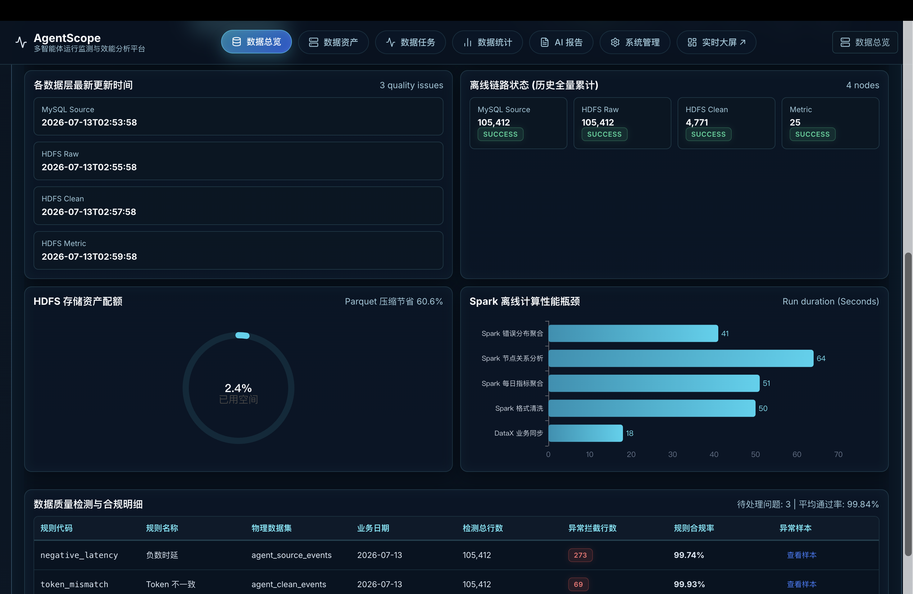

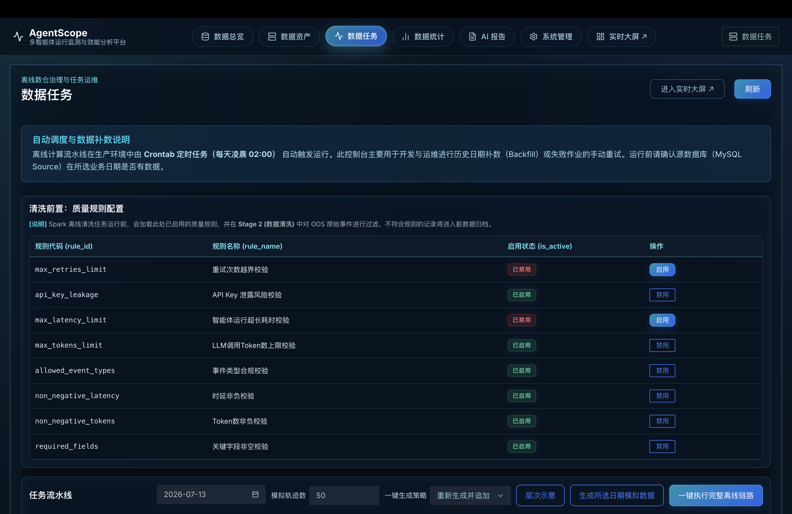

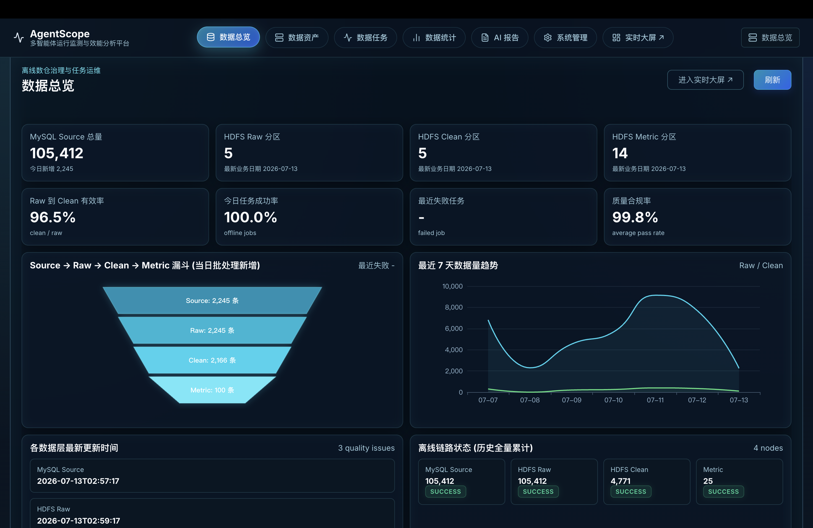

### 数据任务
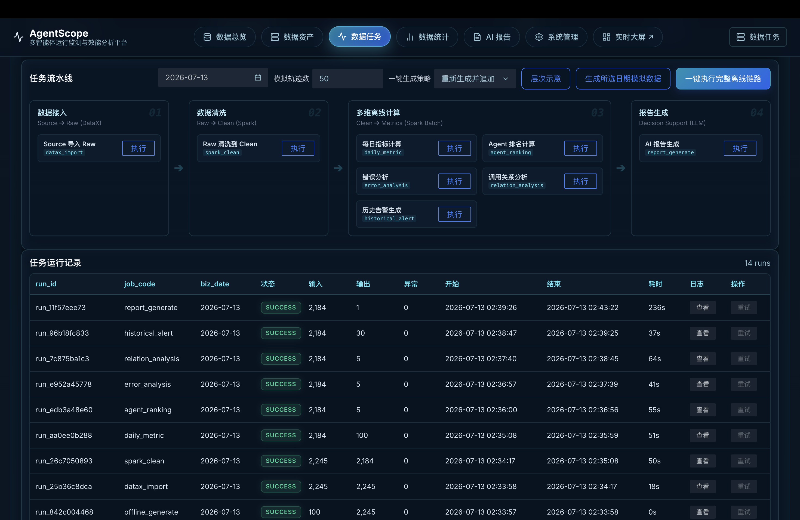

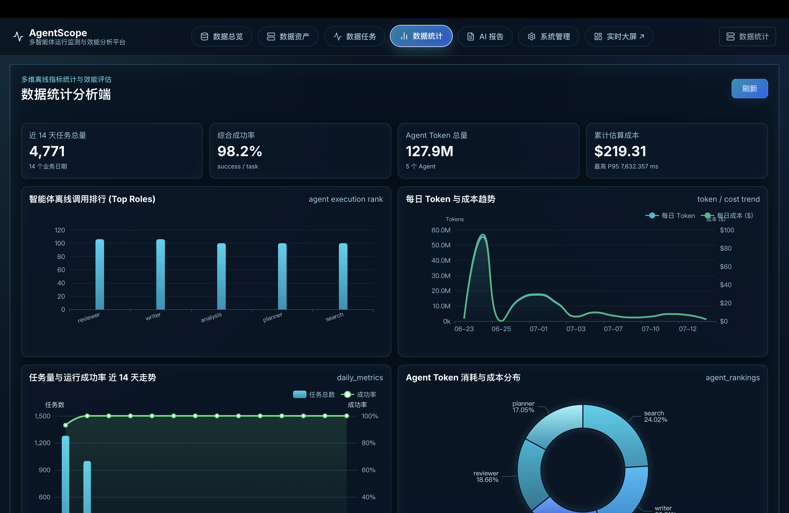

### 数据统计分析
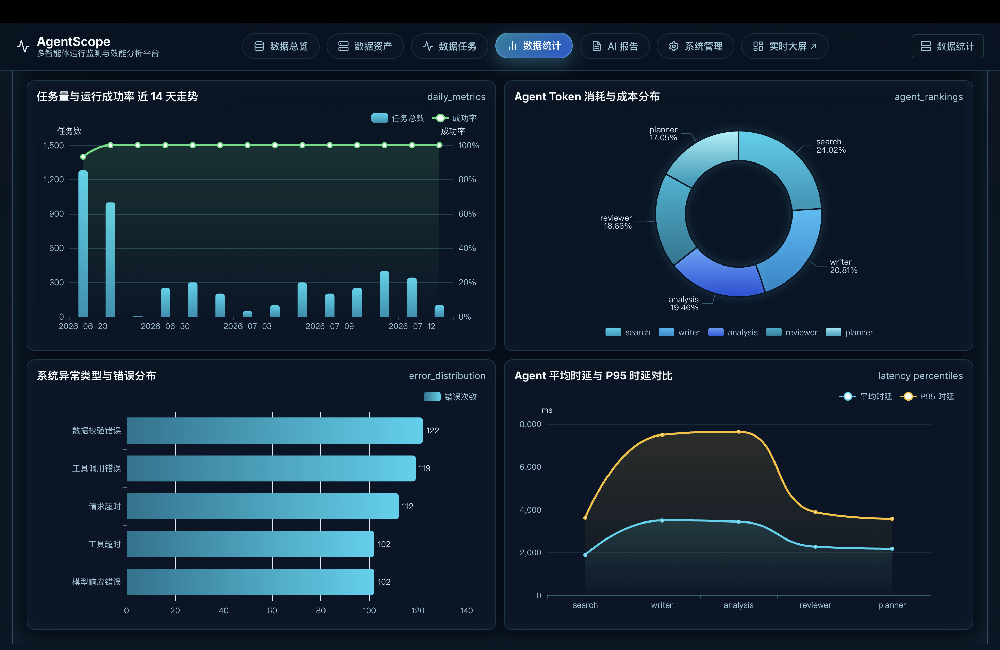

### AI 报告
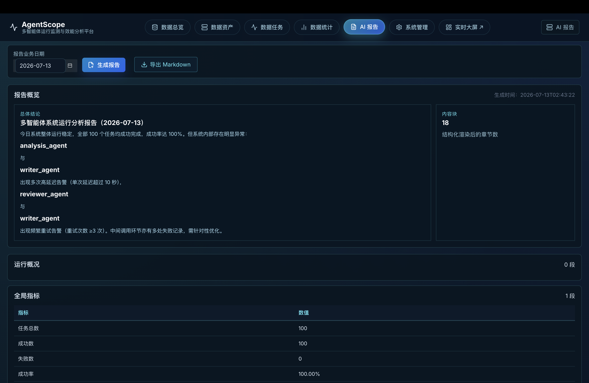

### 系统管理
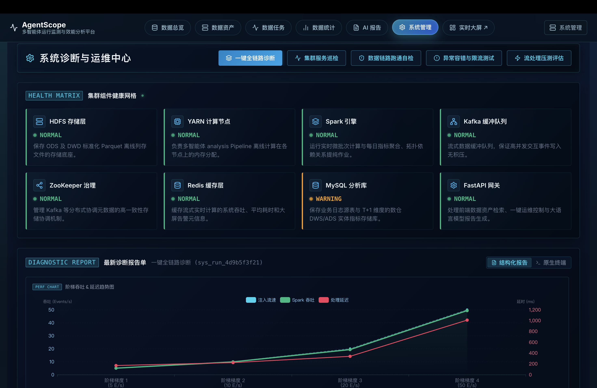

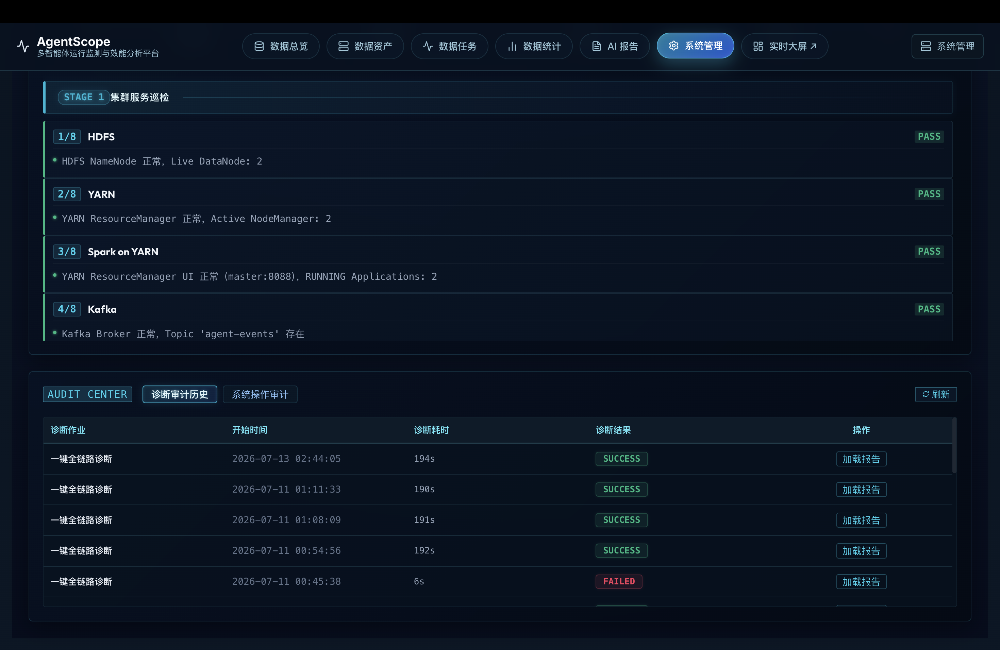

### 数据资产
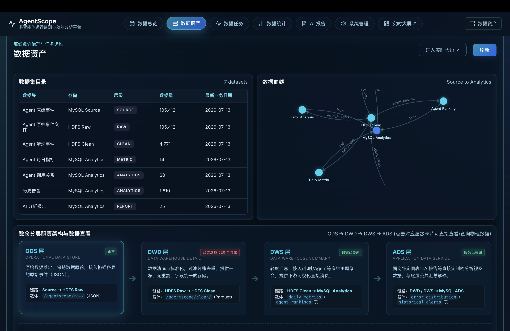

### 实时大屏
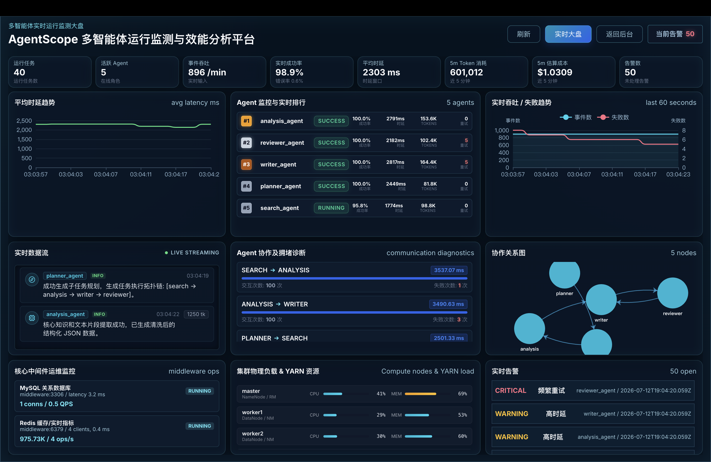

---

## 🏗️ 系统架构

本项目采用经典的 Lambda 大数据架构，其核心技术流与数据分层拓扑如下：

```mermaid
%%{init: {
  "theme": "base",
  "themeVariables": {
    "fontFamily": "Inter, PingFang SC, Microsoft YaHei, sans-serif",
    "fontSize": "15px",
    "primaryTextColor": "#263238",
    "lineColor": "#78909C",
    "edgeLabelBackground": "#FFFFFF",
    "clusterBkg": "#FFFFFF",
    "clusterBorder": "#CFD8DC"
  },
  "flowchart": {
    "curve": "basis",
    "nodeSpacing": 38,
    "rankSpacing": 55,
    "padding": 14
  }
}}%%

graph LR

    subgraph Src["数据源"]
        Sim["Agent 运行模拟器<br/>Python"]:::source
    end

    subgraph StreamingPipeline["实时流监控"]
        Kafka["Kafka<br/>消息队列"]:::stream
        SparkStreaming["Spark Streaming<br/>实时计算引擎"]:::stream
        Redis[("Redis<br/>缓存状态")]:::realtimeDb
    end

    subgraph BatchPipeline["离线数仓计算"]
        MySQL_Src[("MySQL Source<br/>业务源库")]:::sourceDb
        DataX["DataX<br/>同步管道"]:::batch
        HDFS_Raw["HDFS ODS<br/>原始数据贴源层"]:::batch
        SparkClean["Spark DWD<br/>数据明细清洗层"]:::batch
        SparkBatch["Spark DWS<br/>公共汇总计算层"]:::batch
        SparkADS["Spark ADS<br/>应用服务定制层"]:::batch
        MySQL_Ana[("MySQL Analytics<br/>分析与应用库")]:::analyticsDb
    end

    subgraph Serving["微服务与展示"]
        FastAPI["FastAPI<br/>业务网关"]:::service
        LLM["LLM<br/>AI 分析接口"]:::ai
        VueUI["Vue 3 + ECharts<br/>大屏与管理端"]:::ui
    end

    %% 数据源链路
    Sim -.->|"实时写入<br/>Kafka Producer"| Kafka
    Sim -->|"离线落地<br/>JDBC"| MySQL_Src

    %% 实时流转
    Kafka -->|"微批次 Pull"| SparkStreaming
    SparkStreaming -->|"实时汇总与告警"| Redis

    %% 离线数仓流转
    MySQL_Src -->|"定时 DataX 调度"| DataX
    DataX -->|"HDFS Write"| HDFS_Raw
    HDFS_Raw -->|"CleanJob · Scala"| SparkClean
    SparkClean -->|"Parquet"| SparkBatch
    SparkClean -->|"异常与拓扑"| SparkADS
    SparkBatch -->|"公共汇总 ➔ DWS表"| MySQL_Ana
    SparkADS -->|"定制视图 ➔ ADS表"| MySQL_Ana

    %% 服务与展示
    Redis -->|"实时数据读取"| FastAPI
    MySQL_Ana -->|"指标查询与作业控制"| FastAPI
    FastAPI -->|"指标快照推送"| LLM
    LLM -->|"分析报告生成"| FastAPI
    FastAPI -->|"REST API · SSE"| VueUI

    %% 节点配色
    classDef source fill:#EDE9FE,stroke:#7C3AED,stroke-width:2px,color:#4C1D95;

    classDef stream fill:#E8F1FF,stroke:#3B82F6,stroke-width:2px,color:#1E3A8A;
    classDef realtimeDb fill:#E0F2FE,stroke:#0284C7,stroke-width:2px,color:#0C4A6E;

    classDef sourceDb fill:#FFF7ED,stroke:#F97316,stroke-width:2px,color:#7C2D12;
    classDef batch fill:#FEF3C7,stroke:#D97706,stroke-width:2px,color:#78350F;
    classDef analyticsDb fill:#FFEDD5,stroke:#EA580C,stroke-width:2px,color:#7C2D12;

    classDef service fill:#DCFCE7,stroke:#16A34A,stroke-width:2px,color:#14532D;
    classDef ai fill:#E0E7FF,stroke:#4F46E5,stroke-width:2px,color:#312E81;
    classDef ui fill:#CCFBF1,stroke:#0D9488,stroke-width:2px,color:#134E4A;

    %% 分区背景
    style Src fill:#FAF8FF,stroke:#A78BFA,stroke-width:1.5px,color:#4C1D95
    style StreamingPipeline fill:#F5F9FF,stroke:#93C5FD,stroke-width:1.5px,color:#1E3A8A
    style BatchPipeline fill:#FFFBF2,stroke:#FCD34D,stroke-width:1.5px,color:#78350F
    style Serving fill:#F3FCF8,stroke:#86EFAC,stroke-width:1.5px,color:#14532D
```

---

## 📁 目录结构

```text
agentscope/
├── backend/              # FastAPI 后端服务 (提供大盘 REST API、任务控制与 AI 报告生成)
├── frontend/             # Vue 3 + ECharts 大屏可视化前端与数仓治理管理端
├── simulator/            # Agent 事件模拟器 (支持实时 Kafka 发送和离线 MySQL 历史数据注入)
├── spark-streaming/      # Spark Streaming 实时计算作业 (Scala 2.11 + Spark 2.4)
├── spark-batch/          # Spark Batch 离线清洗、数仓聚合分析作业 (Scala 2.11 + Spark 2.4)
├── sql/                  # 数据库架构初始化脚本 (业务库 source 与数仓库 analytics)
├── scripts/              # 运维控制与自动化总控脚本 (DataX 导入, Spark 提交, 健康检查等)
└── docs/                 # 项目技术文档、部署架构方案与性能测试报告
```

---

## 🚀 快速开始

本项目依赖真实的 Hadoop/Spark 分布式集群环境运行。

### 1. 环境准备与初始化

1. 确保 Hadoop (HDFS, YARN), Spark client, Kafka, Redis, MySQL 正常运行。Spark 作业默认提交到 YARN，Standalone 仅作为显式 fallback。
2. 初始化数据库结构：
   ```bash
   mysql -u root -p < sql/source_schema.sql
   mysql -u root -p < sql/analytics_schema.sql
   ```
3. 创建 Kafka 实时主题：
   ```bash
   bash scripts/create_kafka_topics.sh
   ```

### 2. 启动服务

**启动后端服务 (FastAPI):**
```bash
cd backend
python -m venv .venv
source .venv/bin/activate
pip install -r requirements.txt
uvicorn app.main:app --host 0.0.0.0 --port 8000 &
```

**启动实时监控链路 (Spark Streaming):**
```bash
bash scripts/start_streaming_job.sh
```

Spark 提交默认使用 YARN client 模式：

```bash
export SPARK_MASTER_URL=yarn
export SPARK_DEPLOY_MODE=client
export HADOOP_CONF_DIR=/usr/local/hadoop-2.7.6/etc/hadoop
export YARN_CONF_DIR=/usr/local/hadoop-2.7.6/etc/hadoop
```

如需临时回退 Spark Standalone，可显式覆盖：

```bash
export SPARK_MASTER_URL=spark://master:7077
```

**构建并运行前端大屏 (Vue 3 + Vite):**
```bash
cd frontend
npm install
npm run build     # 静态打包输出
# 或使用本地调试开发服务：
npm run dev -- --host 0.0.0.0 --port 5173
```

---

## 🏗️ 分布式集群部署说明

本项目采用典型的 Lambda 架构，在实际分布式生产环境中，建议按如下节点划分及顺序启动：

### 1. 节点角色分配与拓扑

| 主机名 | 核心组件分配 |
| :--- | :--- |
| **`master`** | Hadoop NameNode / YARN ResourceManager / Spark 提交客户端 / FastAPI 后端 |
| **`middleware`** | MySQL (业务与数仓) / Redis (缓存) / ZooKeeper / Kafka Broker |
| **`slave1`, `slave2`** | HDFS DataNode / YARN NodeManager |

### 2. 基础集群与中间件启动顺序

按照以下物理依赖顺序逐步启动集群服务：

1. **分布式存储与资源计算调度（`master` 节点）**：
   ```bash
   start-dfs.sh
   start-yarn.sh
   ```
   Spark 使用 YARN 作为资源调度器，不需要默认启动 Spark Standalone Master/Worker。若需临时回退 Standalone，可显式设置 `SPARK_MASTER_URL=spark://master:7077` 并自行启动 Standalone 集群。
2. **中间件与数据库服务（`middleware` 节点）**：
   - 依次启动：`MySQL ➔ Redis ➔ ZooKeeper ➔ Kafka`。
   - 检查 Kafka 探针端口（`9092`）及创建实时事件 Topic：
     ```bash
     /usr/local/kafka/bin/kafka-topics.sh --create --zookeeper middleware:2181 --replication-factor 1 --partitions 1 --topic agent-events
     ```

### 3. 后端服务与流计算作业提交

1. **提交实时流计算作业（`master` 提交）**：
   ```bash
   /usr/local/spark/bin/spark-submit \
     --class com.agentscope.streaming.AgentEventStreamingJob \
     --master yarn \
     --deploy-mode client \
     --driver-memory 512m --executor-memory 512m \
     spark-streaming/target/agentscope-spark-streaming-0.1.0.jar \
     --kafka-bootstrap middleware:9092 --topic agent-events --redis-host middleware --redis-port 6379
   ```
2. **守护进程运行 FastAPI 后端（`master` 节点）**：
   ```bash
   cd backend && source .venv/bin/activate
   nohup uvicorn app.main:app --host 127.0.0.1 --port 8000 > backend.log 2>&1 &
   ```

### 4. 前端静态代理与 Nginx 反向代理配置

生产环境下，前端 Vue 3 工程打包后通过 Nginx 进行反向代理与静态资源托管。

1. **编译打包前端**：
   ```bash
   cd frontend && npm install && npm run build
   # 打包生成的静态文件位于 dist/ 目录下
   ```
2. **配置 Nginx (`/etc/nginx/nginx.conf` 或 `deploy/nginx.conf`)**：
   ```nginx
   server {
       listen 80;
       server_name localhost;

       # 托管前端打包静态文件
       root /var/www/html/dist;
       index index.html;

       # 路由代理后端 FastAPI 接口
       location /api/ {
           proxy_pass http://127.0.0.1:8000/api/;
           proxy_set_header Host $host;
           proxy_set_header X-Real-IP $remote_addr;
       }

       location /health {
           proxy_pass http://127.0.0.1:8000/health;
       }

       location / {
           try_files $uri $uri/ /index.html;
       }
   }
   ```
3. **加载配置**：`nginx -t && nginx -s reload`。

---

## 📊 数据管道运维与测试

### 1. 产生模拟数据
* **实时模式**（向 Kafka 持续注入流数据）：
  ```bash
  python simulator/main.py --mode realtime --kafka-bootstrap middleware:9092 --rate 15
  ```
* **离线数据生成与自动调度**：
  * **定时自动运行**：项目在 `deploy/agentscope.cron` 中提供了 **Crontab 定时任务，每天凌晨 02:00** 自动触发离线数据生成与计算 Pipeline 的配置；你可以直接安装它，或用 `scripts/install_cron.sh` 自动写入当前机器的 crontab。
  * **手工回刷/调试**：若需手工回刷或补数，您可以通过数据管理端（`/admin`）的 **「数据任务管理」**，在日期选择器选定特定日期后，点击 **「生成所选日期模拟数据」**，系统将自动向业务库源表注入所选日期的事件。

### 2. 离线数仓 Pipeline 执行
执行离线总控脚本，流水线将自动完成 ODS ➔ DWD ➔ DWS ➔ ADS 数据流转（包含 DataX 同步、Spark 清洗及指标统计）：
```bash
bash scripts/run_daily_offline_pipeline.sh [业务日期, 格式 YYYY-MM-DD]
```
> [!TIP]
> * **日期参数说明**：如果您执行时不传入日期参数，脚本将默认以**当前系统当天日期**运行分析。例如要手动回刷/测试 `2026-06-30` 的历史数据，请显式传入该日期：`bash scripts/run_daily_offline_pipeline.sh 2026-06-30`。
> * **工作流状态指示**：在执行过程中，数据管理端的数据任务看板将通过高亮状态动画实时指示当前作业在数仓各个阶段（DataX、Spark Clean、Spark Batch）中的流转运行状态。
> * **质量规则与重跑关系**：在数据管理页启用或禁用质量规则只会更新规则配置，不会自动重跑历史数据。如果规则口径变化影响了历史结果，需要针对受影响的业务日期手动重跑清洗。

---

## 🛡️ 数据运行模式与配置 (DATA_MODE)

系统后端内置了数据源回退的保护机制，支持通过环境变量 `DATA_MODE` 显式控制运行模式，并在所有响应中返回数据源元信息（`data_source`, `fallback`, `reason`）：

*   **`DATA_MODE=demo`（默认演示模式）**：
    *   为了在网络环境不佳或中间件连接不稳定时保证系统的服务可用性，当 Redis/MySQL 连接超时或目标表为空无数据时，系统将**自动降级（fallback）并返回预置的高质量 Mock 数据**，并输出元信息 `"data_source": "mock", "fallback": true`。
*   **`DATA_MODE=strict`（真实生产验证模式）**：
    *   **严格禁止数据回退/伪造**。当底层 Hadoop/YARN/Redis 真实链路中无数据或连接失败时，系统将直接返回空数组、空对象或返回 HTTPException 错误，用于严格评估大数据计算链路的吞吐量、实时计算延迟和真实数仓质量。

您可以在后端 `.env` 文件或容器启动参数中设置 `DATA_MODE=strict` / `demo` 进行随时切换。

---

## 📊 核心指标口径与统计规约

为了确保系统分析指标的工程真实性与口径严谨度，平台底层 Spark 离线与流式计算任务严格区分了 **「事件级日志 (Event-level Log)」** 与 **「运行级指标 (Run-level Metric)」**，定义如下：

1.  **事件 (Event)**：多 Agent 协作交互的微观日志（如 `agent_start`, `llm_request`, `llm_response`, `tool_call`, `agent_complete` 等）。单个 Agent 运行流程中会产生多条连续的事件。
2.  **执行 (Run / Task)**：一个 Agent 的完整生命周期流程，对应唯一的 `run_id`。
3.  **指标口径校准**：
    *   **Agent 执行次数 (`execution_count`)**：在 `AgentRankingJob` 中，**严格按照 `run_id` 去重统计**，同一个 Agent + Run 仅计算为 1 次执行，而非按照原始事件条数直接相加，消除冗余。
    *   **成功率 (`success_rate`)**：基于 `run` 级别判断（同一 `run_id` 中只要包含 `agent_complete` 或 status 为 `success`，则该次运行判定为成功）。
    *   **时延 (`latency_ms`)**：以 run 运行周期内的最大 latency 或 complete 结束阶段的时延为准。
    *   **Token 及成本统计 (`total_tokens`, `cost_usd`)**：**仅过滤并聚合 `event_type == 'llm_response'` 的事件**，其他中间协作事件（如工具调用、节点启动）的 Token 和 Cost 强制归零，防止统计虚高，确保成本真实反映 LLM 消耗。
    *   **AI 报告生成机制**：读取 DWS 层汇总指标自动进行效能诊断。**支持 LLM 报告生成；未配置 API Key 时回退为规则模板报告。**

---

## 🛠️ 系统自检与测试工具

*   `run_local_checks.sh`: **本地一键综合自检脚本**。自动完成 Python 代码编译、测试环境初始化、无 key 的 Mock 离线数据生成、模拟器规则模型自愈校验等全流程自检。
*   `start_realtime_yarn_pipeline.sh` / `stop_realtime_yarn_pipeline.sh`: **实时 YARN 流作业启停脚本**。用于把实时 Spark Streaming 以 YARN application 方式启动和停止。
*   `health_check.sh`: **集群一键体检工具**。快速探活 HDFS, YARN, Spark, Kafka, ZK, Redis, MySQL 等所有服务组件。
*   `test_fault_tolerance.sh`: **容错与限流机制测试**。向流处理中写入畸形字段和脏数据，验证 Spark 的鲁棒度与实时异常捕获告警。
*   `benchmark.sh`: **压力测试工具**。测试实时流式计算在不同高并发写入下的处理吞吐上限。

---
*Powered by Apache Hadoop, Apache Spark, Apache Kafka, FastAPI, Vue 3, and DeepSeek.*
